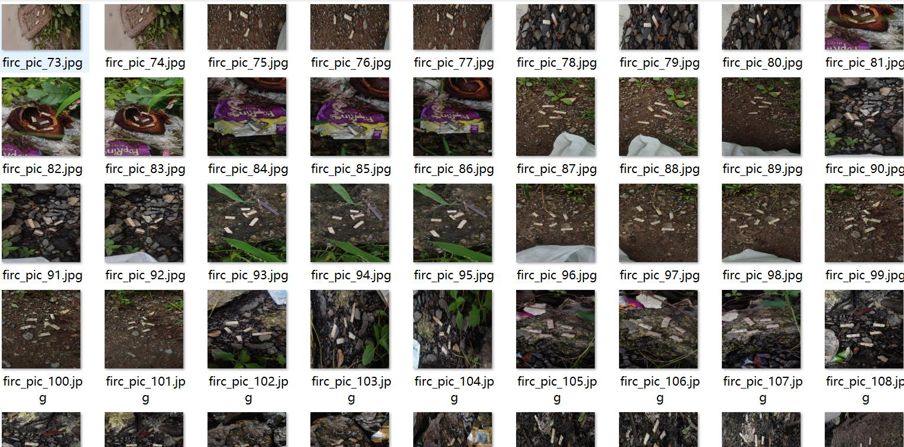
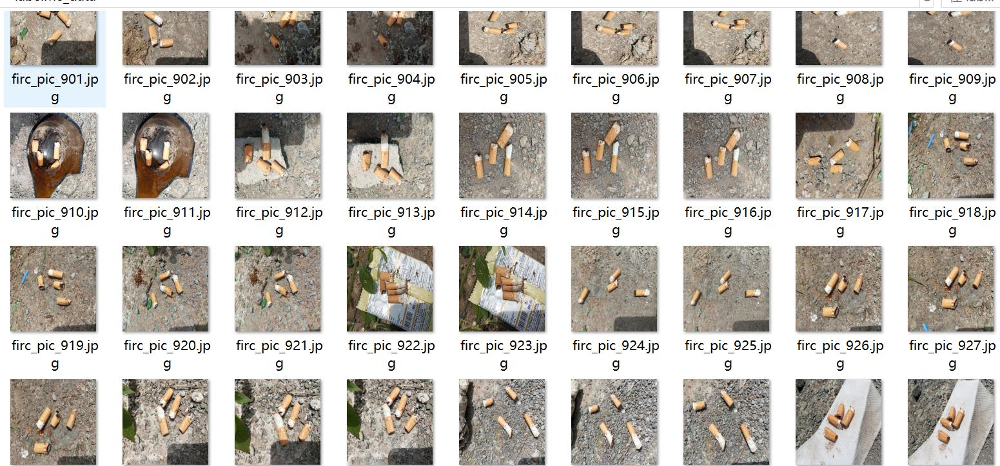
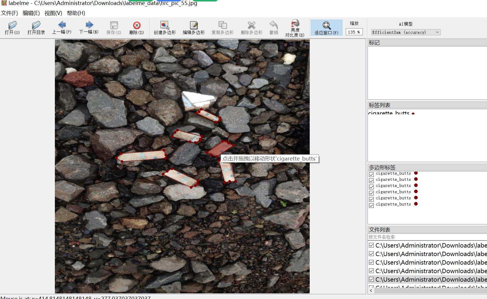

# Ground Truth Data for Cigarette Butts Identification and Segmentation

Dataset format: labelme (without mask files, only including JPG images and corresponding JSON files)

Image count (number of JPG files): 1143
Annotation count (number of JSON files): 1143
Number of categories: 1
Category name: ["cigarette_butts"]
Number of bounding boxes per category: 5336
Tool used for annotations: labelme=5.5.0
Image resolution: 640x640
Annotation rules: Polygon annotation is performed on the category
Important note: The dataset can be opened and edited using labelme. For JSON datasets, they need to be converted into mask or yolo or coco format for semantic segmentation or instance segmentation.
Special declaration: This dataset does not guarantee the accuracy of the trained models or weight files.
Image preview:
Annotation example:
Randomly selected 16 images for annotation:
Annotation drawing result:
Labelme editing image example:

## Image

Here is a pay link on Stripe ( https://buy.stripe.com/3cs8yP7sY87d0vu9AB ). Please contact me lonlonago@foxmail.com after funding $89, and I will send you a complete data files , thank you!

